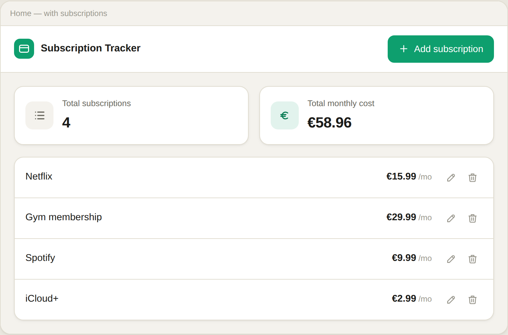
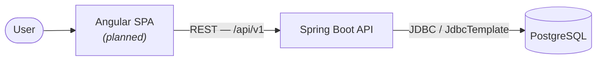

# Subscription Tracker

A web application for keeping track of recurring subscriptions — Netflix, Spotify, a gym — and what they cost per month.

Built as a portfolio project with a deliberately simple domain, so the engineering stays in full view: a hand-written JDBC data layer, versioned migrations, a documented REST API, a modelled architecture and database, and a backend written entirely test-first.

  
  
  
  

<i>Home screen — UI design. Frontend implementation is planned; see <a href="docs/design">docs/design</a> for the full set.</i>

---

## Overview

A user keeps a list of subscriptions, each with a name and a monthly price. Subscriptions can be added, viewed, edited and removed, and the app reports how many there are and the total monthly cost. Names are unique, case-insensitively: `Netflix` and `netflix` are the same subscription.

Project 1 of the **Spring Persistence & Architecture Series**: it covers the lowest level of the persistence stack — **plain JDBC with `JdbcTemplate`** — before the series moves on to JPA/Hibernate ([Recipe Book](https://github.com/mikebg95/recipe-book)) and Spring Data JPA with hexagonal architecture ([Journal](https://github.com/mikebg95/journal)).

## Status

| Component | Status |
|---|---|
| Backend API | Built and tested |
| Frontend (Angular) | Designed — implementation planned |
| Deployment | Planned |

## Architecture

A single-page frontend talks to a stateless REST backend; the backend owns all persistence.

The backend uses a **layered architecture** — controller, service, DAO — in which each layer only talks to the one beneath it and the persistence model never leaves the service layer.

The full C4 model (system context, container, component and dynamic views) is in [`docs/architecture`](docs/architecture); the database schema is in [`docs/database`](docs/database).

## Highlights

- **Hand-written data access** — a DAO interface with a `JdbcTemplate` implementation and parameterized SQL; no JPA, no Spring Data.
- **Flyway migrations** — the schema is versioned; `V2` evolves it from a plain unique constraint to a case-insensitive unique index.
- **Code-first OpenAPI** — the API is documented from the code with springdoc, with Swagger UI in the `dev` profile.
- **RFC 9457 error handling** — one `@RestControllerAdvice` returns `application/problem+json` for validation errors (400), not-found (404) and duplicates (409), without leaking internals.
- **Test-first** — 63 hand-written tests: unit, web slice (`@WebMvcTest`), DAO integration and end-to-end tests against a real PostgreSQL via Testcontainers.

## Tech stack

| Layer | Technology |
|---|---|
| Frontend | Angular · TypeScript *(planned)* |
| Backend | Java 26 · Spring Boot 4.1 · Spring MVC · Bean Validation |
| Persistence | Spring JDBC (`JdbcTemplate`) · PostgreSQL 16 · Flyway |
| API | OpenAPI 3 (code-first, springdoc) |
| Testing | JUnit 5 · Mockito · AssertJ · Testcontainers · JaCoCo |
| Architecture & docs | C4 (Structurizr) · DBML |

## Repository layout

| Path | Contents |
|---|---|
| [`backend/`](backend) | Spring Boot REST API — build, run and test instructions in its own [README](backend/README.md). |
| `frontend/` | Angular single-page application *(planned)*. |
| [`docs/`](docs) | Architecture (C4), database schema (DBML) and UI designs. |

## Getting started

The backend runs on its own today. See [`backend/README.md`](backend/README.md) for prerequisites, how to run it (with a throwaway PostgreSQL container or against your own database) and how to run the test suite.

## Documentation

- **Architecture (C4)** — [`docs/architecture`](docs/architecture)
- **Database schema** — [`docs/database`](docs/database)
- **UI designs** — [`docs/design`](docs/design)
- **API** — Swagger UI at `/swagger-ui.html` when running in the `dev` profile
