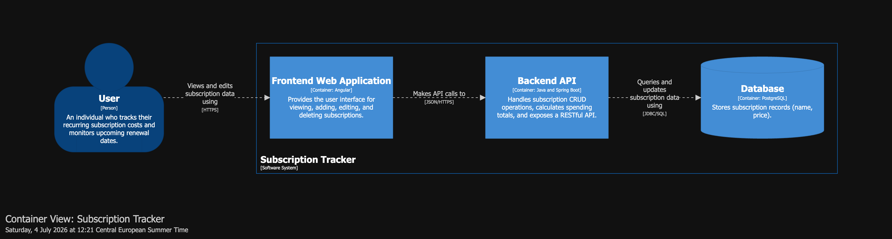
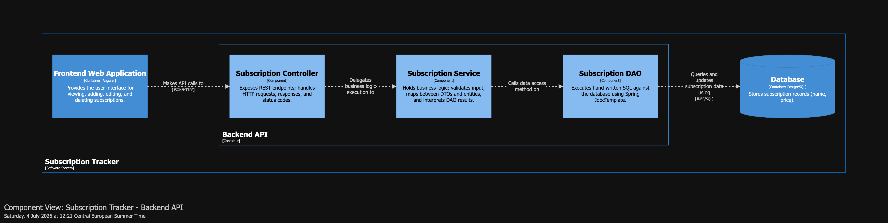
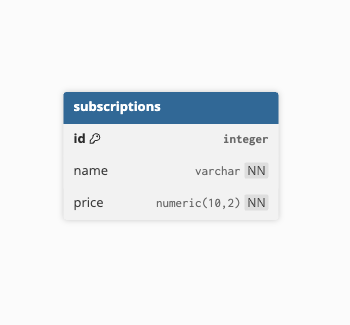

# Subscription Tracker — Backend API

A small REST API for tracking recurring subscriptions (name + monthly price), built to a
production-grade engineering standard. The domain is intentionally simple so that the
engineering — data access, testing, error handling, migrations, API contract, and
configuration — stays in full view.


---

## What it does

You keep a list of the services you pay for — Netflix, Spotify, a gym — each with a name and
a monthly price. The API lets you add, view, edit, and remove them, and reports how many you
have and what they cost you per month. That's the whole feature set.

The value of the project is not the features; it's how it's built.

## Tech stack

| Layer | Choice |
|---|---|
| Language / runtime | Java 26 |
| Framework | Spring Boot 4.1 (Spring MVC) |
| Data access | Spring JDBC — `JdbcTemplate` + hand-written `RowMapper` (no JPA / no Spring Data) |
| Database | PostgreSQL 16 |
| Schema migrations | Flyway |
| Validation | Jakarta Bean Validation |
| API docs | springdoc-openapi (OpenAPI 3 + Swagger UI) |
| Build | Maven (wrapper included) |
| Testing | JUnit 5, Mockito, AssertJ, Testcontainers, JaCoCo |

## Architecture

A conventional layered design with strict boundaries — each layer talks only to the one
beneath it, and the persistence entity never leaves the service layer.

- **Controller** — REST endpoints, request validation, HTTP status/headers. Speaks DTOs only.
- **Service** — transaction boundaries, DTO ⇄ entity mapping, business rules.
- **DAO** — an interface with a `JdbcTemplate` implementation; hand-written parameterized SQL.
- **Database** — schema owned and versioned by Flyway.

The system is modelled with the [C4 model](https://c4model.com/), maintained as code (see
[Architecture-as-code](#architecture-as-code)).

**Container view** — where the backend sits in the wider system:



**Component view** — the backend's internal structure:



### Database schema



A single `subscriptions` table: identity primary key, `name VARCHAR(100)`, `price NUMERIC(10,2)`,
and a **case-insensitive** uniqueness rule on `name` (so `Netflix` and `netflix` collide).

### Architecture-as-code

The full C4 model — System Context, Container and Component views, plus dynamic views for every
request flow (create, read, update, delete, count, total, and the validation, duplicate-name, and
not-found error paths) — and the database schema are maintained as code in the sibling
architecture module:

- C4 model (Structurizr DSL): [`workspace.dsl`](../subscription-tracker-architecture/c4/workspace.dsl)
- DB schema (DBML): [`schema.dbml`](../subscription-tracker-architecture/database/schema.dbml)
- Rendering instructions and the full view catalogue: [architecture README](../subscription-tracker-architecture/README.md)

## API

All endpoints are versioned under `/api/v1`, applied centrally via a `PathMatchConfigurer`.
Errors are returned as [RFC 9457 Problem Details](https://www.rfc-editor.org/rfc/rfc9457)
(`application/problem+json`).

| Method | Path | Success | Errors |
|---|---|---|---|
| `POST` | `/api/v1/subscriptions` | `201 Created` + `Location` | `400`, `409` |
| `GET` | `/api/v1/subscriptions` | `200 OK` | — |
| `GET` | `/api/v1/subscriptions/{id}` | `200 OK` | `400`, `404` |
| `PUT` | `/api/v1/subscriptions/{id}` | `200 OK` | `400`, `404`, `409` |
| `DELETE` | `/api/v1/subscriptions/{id}` | `204 No Content` | `400`, `404` |
| `GET` | `/api/v1/subscriptions/count` | `200 OK` | — |
| `GET` | `/api/v1/subscriptions/total` | `200 OK` | — |

Interactive docs (Swagger UI) are served at `/swagger-ui.html` when the app is running with
docs enabled (default in `dev`).

## Engineering highlights

The decisions below are what the project is really about — each is a deliberate choice with a
reason, not a default.

| Decision | Why |
|---|---|
| **Raw JDBC + DAO**, no JPA/Spring Data | Own the SQL and the row mapping outright — understand the data layer before an ORM hides it. |
| **Parameterized queries throughout** | Immune to SQL injection by construction; proven by a test that feeds a `DROP TABLE` payload and asserts it is stored as literal data. |
| **Separate request/response DTOs (records)** | The database entity never crosses the web boundary; input and output contracts evolve independently. |
| **Centralized error handling** (`@RestControllerAdvice`) | One choke point maps domain exceptions to HTTP semantics and logs unexpected failures once, at `ERROR`. |
| **No information disclosure** | Unexpected exceptions are logged server-side but the client receives a generic message — never `getMessage()` (which can leak DB errors, paths, internals). Enforced by a test. |
| **RFC 9457 Problem Details** | The modern, standard error media type — machine-readable, consistent across every endpoint. |
| **Flyway migrations** | Every schema change is a versioned, immutable migration. V2 evolves the schema — dropping a plain unique constraint for a case-insensitive unique index — demonstrating real schema evolution, not a one-shot script. |
| **Bean Validation at the edge** | Bad input is rejected before it reaches business logic, with structured `400` responses. |
| **URI API versioning** (`/api/v1`) | Applied centrally so the version is a cross-cutting concern, not repeated on every controller. |
| **Externalized, per-profile config** | Datasource credentials come from the environment (12-factor); `dev`/`prod`/`test` profiles differ only where they must. |
| **Structured logging** | Human-readable text in `dev`; native ECS **JSON to stdout in `prod`** — ready for a log aggregator, the standard for containerized deployment. |

## Testing

Test-driven, with the full backend testing pyramid. Fast, isolated tests at the bottom;
progressively more realistic (and slower) tests toward the top.

| Level | Scope | Tooling |
|---|---|---|
| **Unit** | Service logic in isolation | JUnit 5, Mockito, AssertJ, `ArgumentCaptor`, parameterized tests |
| **Web slice** | Controller + validation + error mapping, no DB | `@WebMvcTest`, `MockMvc`, `@MockitoBean`, JSON-path assertions |
| **Persistence slice** | DAO against a **real** database | `@SpringBootTest` + Testcontainers, `@Transactional` rollback per test |
| **End-to-end** | Full HTTP → DB → HTTP lifecycle | `RANDOM_PORT`, `RestTestClient`, real Postgres |

Practices worth noting:

- **Testcontainers with real PostgreSQL 16, not H2.** This project hand-writes SQL; H2 diverges
  from Postgres exactly there (identity columns, `RETURNING`, functional unique indexes). Testing
  against the real engine is the only way to trust the DAO. `@ServiceConnection` wires the container
  to Spring with zero manual datasource config.
- **Unit vs. integration are split** at build time — Surefire runs unit tests, Failsafe runs `*IT`
  integration tests — and **JaCoCo merges both** into a single coverage report.
- Edge cases are covered deliberately: constraint violations, duplicate (and case-variant) names,
  validation boundaries, malformed JSON, and the SQL-injection payload mentioned above.

## Getting started

### Prerequisites

- JDK 26
- Docker (for Testcontainers-backed tests and the zero-setup local run)

### Run the app locally (zero database setup)

The test application boots the service with a throwaway Postgres container via Testcontainers:

```bash
./mvnw spring-boot:test-run
```

The API comes up on `http://localhost:8080`, Swagger UI at `http://localhost:8080/swagger-ui.html`.

### Run against your own PostgreSQL

```bash
export DB_URL=jdbc:postgresql://localhost:5432/subscription-tracker
export DB_USERNAME=...
export DB_PASSWORD=...
SPRING_PROFILES_ACTIVE=dev ./mvnw spring-boot:run
```

Flyway applies the migrations on startup.

### Tests & coverage

```bash
./mvnw test      # unit tests only (Surefire)
./mvnw verify    # full pyramid incl. integration tests (Failsafe) + coverage
```

The merged JaCoCo report is written to `target/site/jacoco/index.html`.

## Project layout

```
subscription-tracker-backend/
├── src/main/java/.../
│   ├── controller/   # REST endpoints
│   ├── service/      # business logic, transactions
│   ├── dao/          # JdbcTemplate data access
│   ├── dto/          # request/response records
│   ├── model/        # domain entity
│   ├── exception/    # domain exceptions + @RestControllerAdvice
│   └── config/       # OpenAPI, path-versioning
├── src/main/resources/
│   ├── db/migration/ # Flyway V1, V2
│   └── application*.yaml
└── src/test/java/    # unit, web-slice, DAO IT, E2E IT
```

## Related modules

Part of the [`subscription-tracker`](https://github.com/mikebg95/subscription-tracker) monorepo:

- **`subscription-tracker-architecture`** — C4 model and database schema, as code.
- **`subscription-tracker-frontend`** — web client (separate module).
